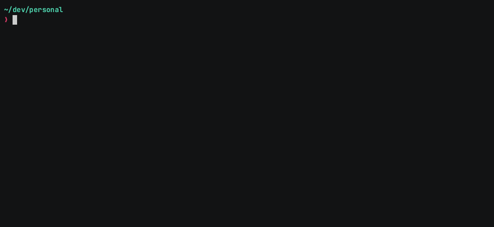

<p align="center">
  <a href="#gh-dark-mode-only" target="_blank" rel="noopener noreferrer">
    
  </a>

  <a href="#gh-light-mode-only" target="_blank" rel="noopener noreferrer">
    
  </a>
</p>

Plugin for skipping the `php` command when running artisan commands and `./sail` or `./vendor/bin/sail` when running sail commands.

## Preview



## Installation

### Using Oh-My-Zsh

```bash
git clone https://github.com/baliestri/laravel.plugin.zsh.git $ZSH_CUSTOM/plugins/laravel.plugin.zsh
```

```bash
~/.zshrc

plugins=(... laravel)
```

### Using Zinit

```bash
zinit light baliestri/laravel.plugin.zsh
```

### Using Zi

```bash
zi light baliestri/laravel.plugin.zsh
```

### Using Zgenom

```bash
zgenom load baliestri/laravel.plugin.zsh
```

## Usage

```bash
cd /path/to/laravel/project # or laravel subdirectory
artisan # instead of php artisan
sail # instead of ./sail or ./vendor/bin/sail
```
